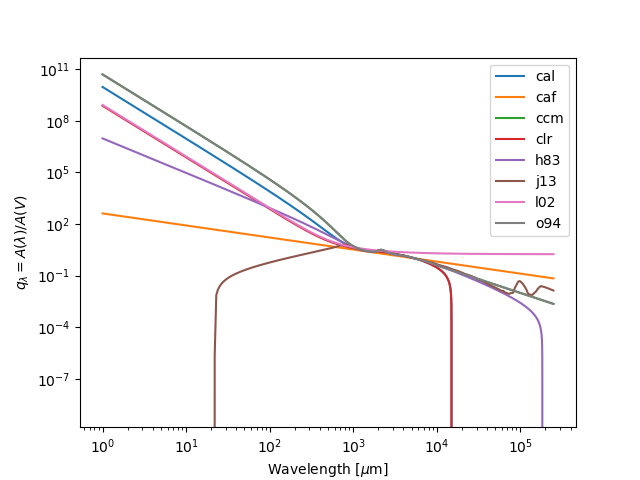

# Reddening - Attenuation Laws

@ Jean Gomes © Copyright ®

RESUME: Reddening directory contains a set of legacy fortran routines to
compute the extinction-laws in galaxies. They are made in agreement with
python f2py standards.

<b>Different attenuation laws</b> 
All of them are computed with a R_V=3.1 and compared.

 <! --- # --- !>

Attenuation laws added:

<table>
<tr>
	<th>Law</th>
	<th>Reference</th>
</tr>

<tr>
	<td>cal</td>
	<td><a href='https://github.com/neutrinomuon/PyDust/blob/main/Literature/Calzetti%20et%20al.%20(2000)%20-%20The%20Dust%20Content%20and%20Opacity%20of%20Actively%20Star-forming%20Galaxies.pdf'>Calzetti et al. (2000)</a></td>
</tr>

<tr>
	<td>caf</td>
	<td><a href='https://github.com/neutrinomuon/PyDust/blob/main/Literature/Charlot%20and%20Fall%20(2000)%20-%20A%20Simple%20Model%20for%20the%20Absorption%20of%20Starlight%20by%20Dust%20in%20Galaxies.pdf'>Charlot and Fall (2000)</a></td>
</tr>

<tr>
<td>ccm</td>
<td><a href='https://github.com/neutrinomuon/PyDust/blob/main/Literature/Cardelli%2C%20Clayton%20and%20Mathis%20(1989)%20-%20%20The%20Relationship%20between%20Infrared%2C%20Optical%2C%20and%20Ultraviolet%20Extinction.pdf'>Cardelli, Clayton and Mathis (1989)</a></td>
</tr>

<tr>
<td>clr</td>
<td><a href='https://github.com/neutrinomuon/PyDust/blob/main/Literature/Calzetti%20et%20al.%20(2000)%20-%20The%20Dust%20Content%20and%20Opacity%20of%20Actively%20Star-forming%20Galaxies.pdf'>Calzetti et al. (2000)</a> plus <a href='https://github.com/neutrinomuon/PyDust/blob/main/Literature/Leitherer%20et%20al.%20(2002)%20-%20Global%20fr-ultraviolet%20(912-1800A)%20properties%20of%20star-forming%20galaxies.pdf'>Leitherer et al. (2002)</a></td>
</tr>

<tr>
<td>h83</td>
<td><a href='https://github.com/neutrinomuon/PyDust/blob/main/Literature/Howarth%20(1983)%20-%20LMC%20and%20galactic%20extinction.pdf'>Howarth (1983)</a></td>
</tr>

<tr>
<td>j13</td>
<td><a href='https://github.com/neutrinomuon/PyDust/blob/main/Literature/Jones%20et%20al.%20(2013)%20-%20The%20evolution%20of%20amorphous%20hydrocarbons%20in%20the%20ISM:%0Adust%20modelling%20from%20a%20new%20vantage%20point.pdf'>Jones et al. (2013)</a> plus <a href='https://github.com/neutrinomuon/PyDust/blob/main/Literature/K%C3%B6hler%2C%20Jones%20and%20Ysard%20(2014)%20-%20A%20hidden%20reservoir%20of%20Fe-FeS%20in%20interstellar%20silicates%3F.pdf'>Koehler et al. (2014)</a> - see also <a href='https://github.com/neutrinomuon/PyDust/blob/main/Literature/Compi%C3%A8gne%20et%20al.%20(2011)%20-%20The%20global%20dust%20SED:%20tracing%20the%20nature%20and%20evolution%20of%20dust%20with%20DustEM.pdf'>Compiègne et al. (2011)</a> for the code <a href='https://www.ias.u-psud.fr/DUSTEM/'>DustEm</a></td>
</tr>

<tr>
<td>l02</td>
<td><a href='https://github.com/neutrinomuon/PyDust/blob/main/Literature/Leitherer%20et%20al.%20(2002)%20-%20Global%20fr-ultraviolet%20(912-1800A)%20properties%20of%20star-forming%20galaxies.pdf'>Leitherer et al. (2002)</a></td>
</tr>

<tr>
<td>o94</td>
<td><a href="https://github.com/neutrinomuon/PyDust/blob/main/Literature/O'Donnell%20(1994)%20-%20Rv-dependent%20Optical%20and%20Near-Ultraviolet%20Extinction.pdf">O'donnell (1994)</a></td>
</tr>

<tr>
<td>s79</td>
<td><a href='https://github.com/neutrinomuon/PyDust/blob/main/Literature/Seaton%20(1979)%20-%20Interstellar%20extinction%20in%20the%20UV.pdf'>Seaton (1979)</a></td>
</tr>

</table>

 
In order to compile the fortran routines to Python use:

source Reddening.compile

There are already, at least, two other projects for attenuation laws in python:

1) dust_extinction:

https://dust-extinction.readthedocs.io/en/latest/dust_extinction/choose_model.html#grain-models

2) extinction

https://extinction.readthedocs.io/en/latest/

They are useful for comparison. It is useful for comparison. However, these
projects are (were) somewhat limited by the time this routines were assembled.

15/01/2022

<table border=0><tr>

 <! --- # --- !>
<td align="center"></td><td>LOGS</td>
</tr>

<tr><td>08/02/2022</td>
<td>There were some problems in the previous version. They were not fully
compatible with Python and were producing strange results. These routines were
then revised. The routines here were tested.</d></tr>

<tr><td>17/10/2022</td>
<td>New revised text and structure for the ReadMe file.</td></tr>

<tr><td>24/10/2022</td>
<td>Description and references to attenuation laws added. Modification of log file</td></tr>

</table>
